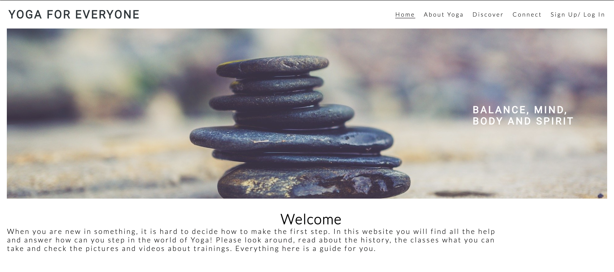
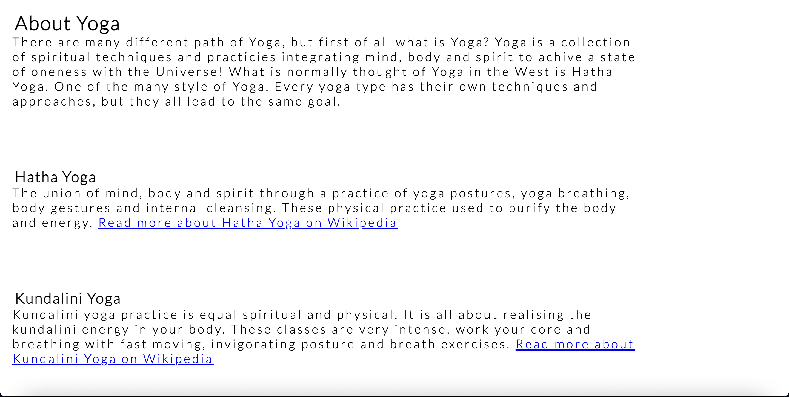
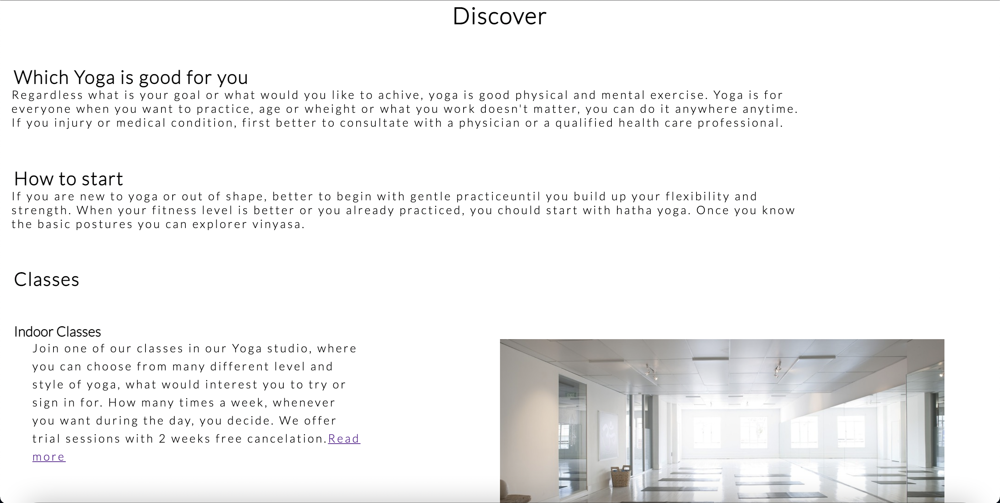
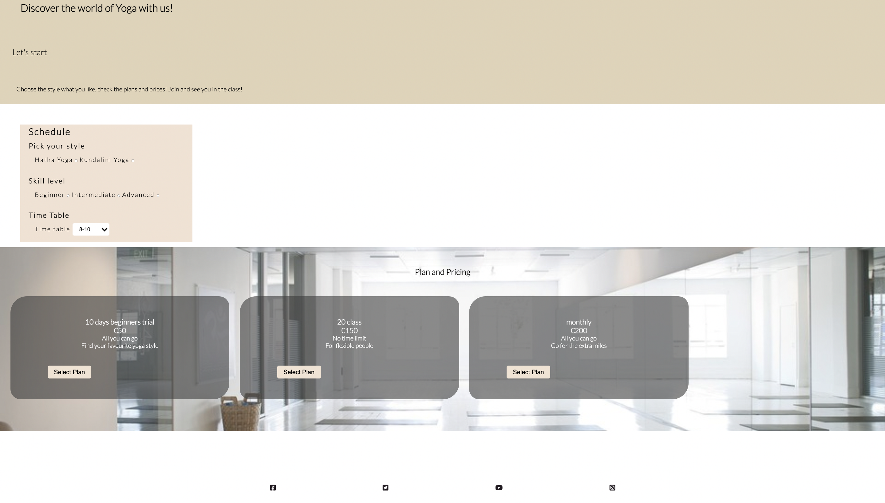
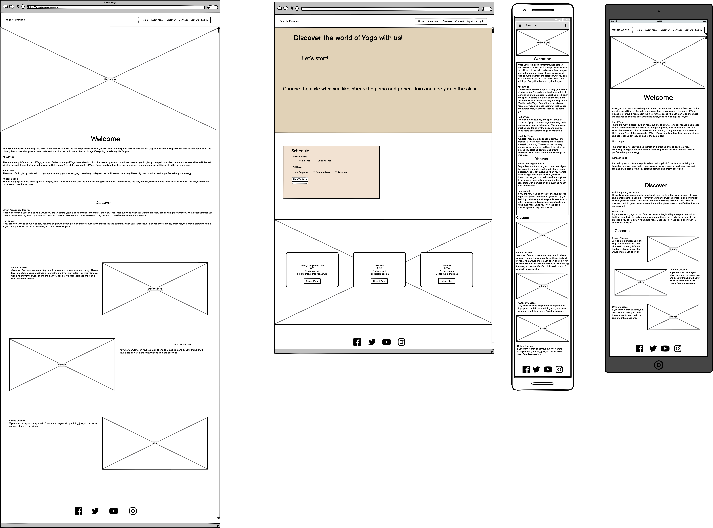
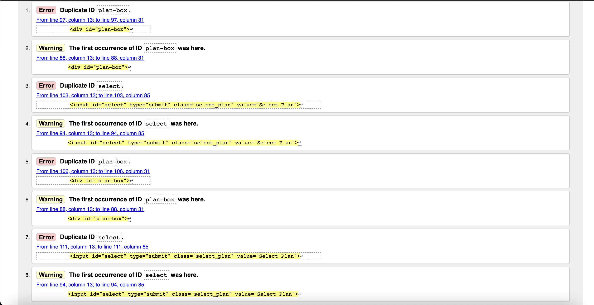
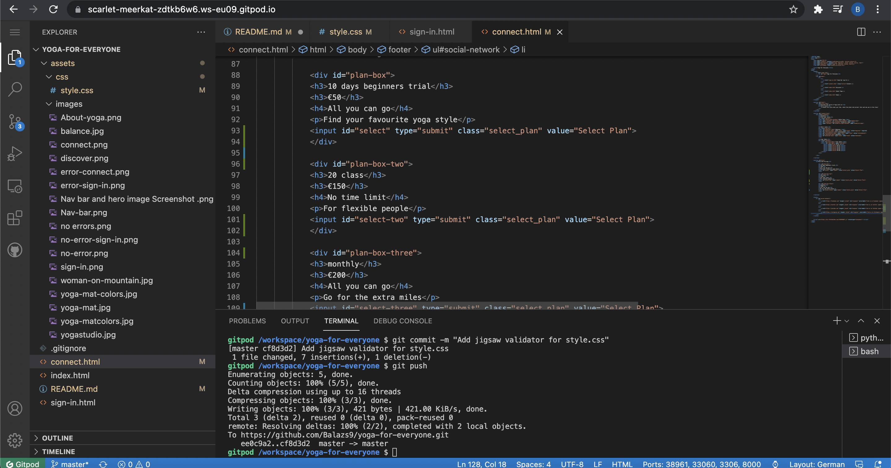
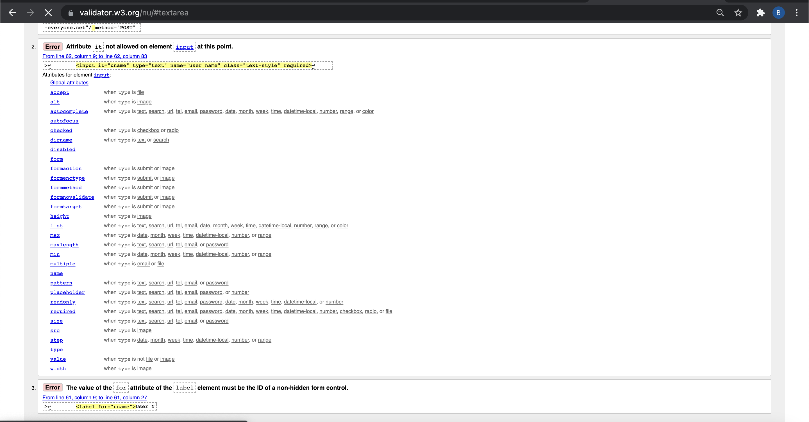
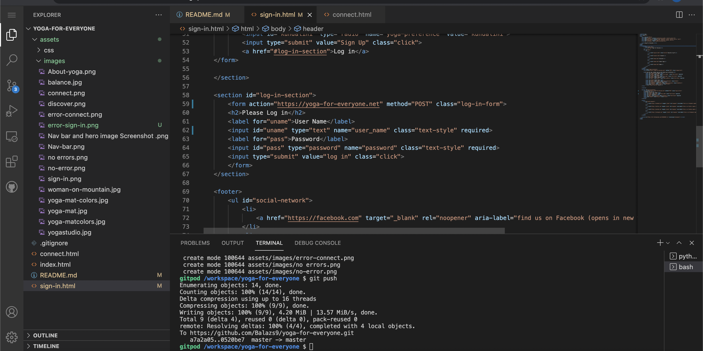
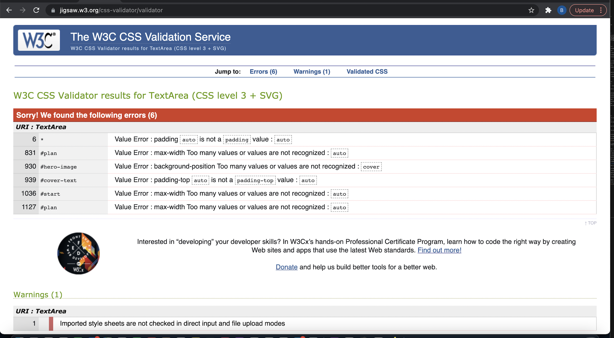

# Contents:

1. Introduction

2. UX:

    - User goals
    
    - Creator goals

    - Development plans:

    I. Strategy

    II. Scope

    III. Structure

    IV. Skelton

    V. Surface

3. Features

4. Issues

5. Technologies
    
    - languages used

6. Testing

7. Deployment

8. Credits

# Yoga-for-everyone

Yoga for everyone is a website targeting people with all different skill levels and experience in yoga. Could be anyone who is interested in it, or want to make it part of their life and daily routine. To help everyone to train not just their body, but their mind and soul too. To train in a group where they feel good and calm, to release the stress and charge with positive energie. The site is providing informations about different style of yoga, which can be practiced either online or in our studio sessions. Free your mind, strenghts your body, join us today!

## User Experience

### User goals:

1. First time visitor: 

    - easily understandable site and porpuse of the business

    - easy navigation

    - beginners who want to try and learn yoga

    - anyone who already practicing, but would like to improve skills

    - easy registrations and payment options

2. Returning user:

    - yoga is part of their daily routine and they want to continue

    - they are happy with the group or with the instructor

    - correct pricing

    - easy well managed, well designed website

### Creators goal:

1. user friendly website

2. it will work on all devices

3. presentation of images on a wide space to introduce and navigate the client

### Development plans:

IV. Skelton:

V. Surface:

    Colors: 

    - The main colors used for the website are almond, beige, black and white, with colors of rainbow in one of the section of the website.

    Typography:

    - The Roboto and Lato pairing is used on the website with sans serif.

    Images: 

    - Pixabay [https://pixabay.com/] where the accurate pictures found, all selected carefully with the goal in mind to represent a proffesional yoga website.

I. Strategy:

## Features

1. Existing features: 
    
    I. on all pages

    - Fixed navbar: allows user to go over the entire website and find what they looking for, with jump on page

    - Footer: contains social social media icons

    II. Home page:

    

    

    

    III. Connect page:

    

    IV. Sign in page:

    

2. Features to implement: 

    - make a Log in page

    - terms and conditions page

## Issues

During the development the issues what needed to be fixed:

1. Align 2 divs side by side: searching for the problem on [https://stackoverflow.com/questions/36152145/align-2-divs-side-by-side-in-a-parent] and there found similar problem with a help, what the developer could use as a navigator to fix the issue.

2. Make the divs screen responsive: found a similar problem on [https://stackoverflow.com/questions/12645366/css-responsive-center-div] and with the help of this was able to find the error what caused the issue.

## Technologies:

    - HTML5

    - CSS3

    1. Font Awesome:

        -Icons in the footer of each site were taken from font awsome

    2. Google Fonts:

        -google fonts were used to import Lato and Roboto font into style.css

    3. Git:

        -git was used for version control

    4. Github:

        -to store the project code

    5. Wireframe:

        I. Figma wireframe

[figma](https://www.figma.com/proto/riVSjbwqPgF0yEbB2yOyYp/Untitled?node-id=2%3A0&scaling=min-zoom)

        II. Balsamiq Wireframes for three different screen type

    6. Coolors:
        Find colors from a wide selection
        [coolors](https://coolors.co/d496a7-9d695a-78e0dc-8eedf7-a1cdf1)

## Testing

    1. HTML validator:

        I. index.html: No errors or warning to show.

        II. connect.html: 

            -error messages:

            -no error messages after correcting: removed duplicate id and input lines

[w3c validator](https://validator.w3.org/nu/#textarea)

       
        III. sign-in.html:

            -error messages:

            -no error message after correcting, correct letter, and remove /

    
    2. Jigsaw validator for the CSS file

            - style.css file: no error or warning message

[jigsaw css validator](https://jigsaw.w3.org/css-validator)

            -no error messages after correcting: changed value from auto to numbers

## Credits

1. Pixabay: for the photos what was used for the website

    [https://pixabay.com/]

2. Wikipedia: for the knowledge about Yoga

    Hatha Yoga [https://en.wikipedia.org/wiki/Hatha_yoga]

    Kundalini Yoga [https://en.wikipedia.org/wiki/Kundalini_yoga]
