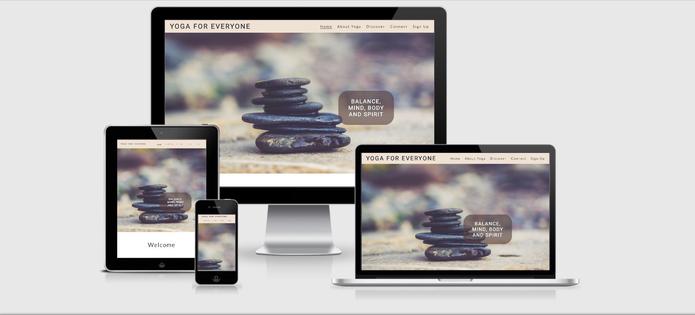
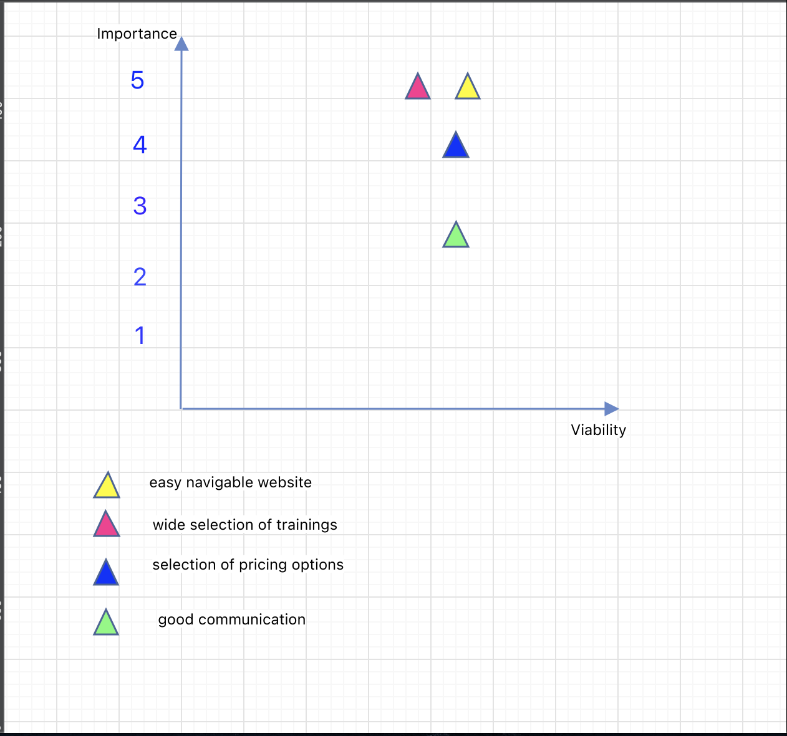
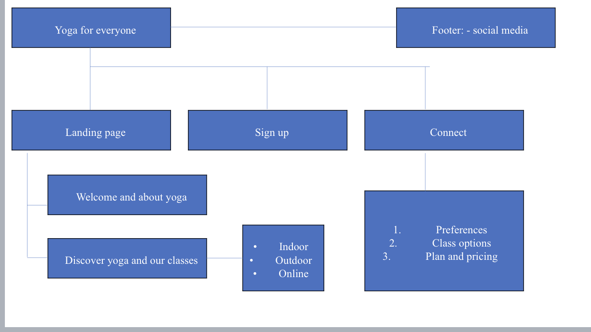
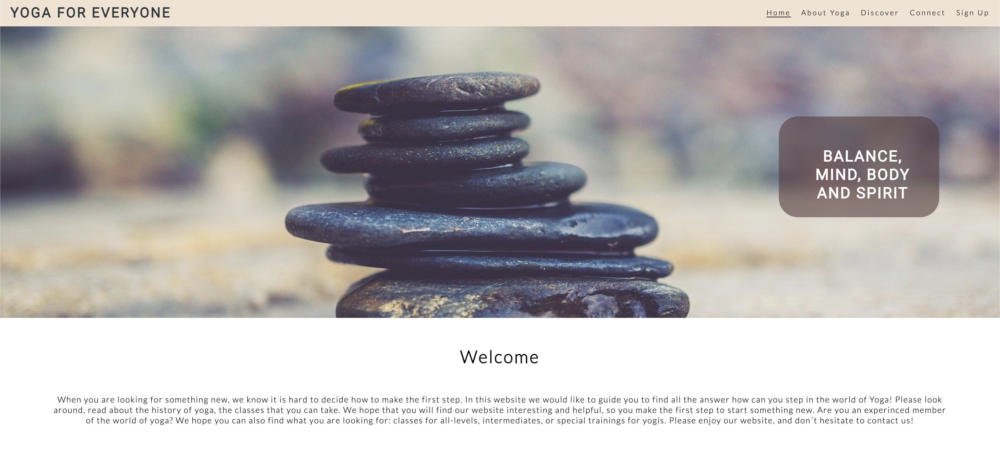
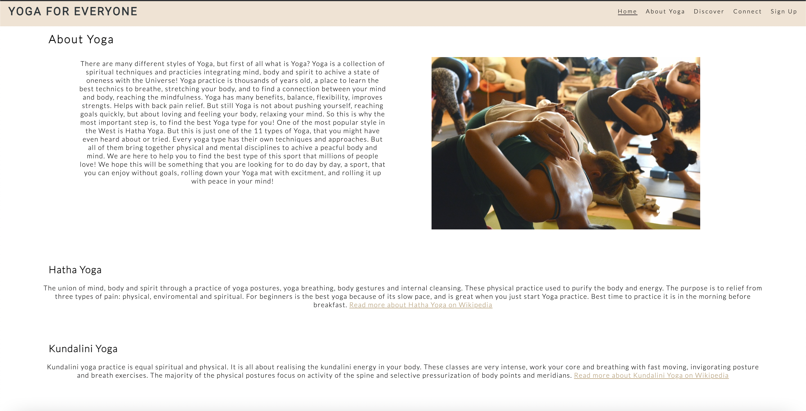
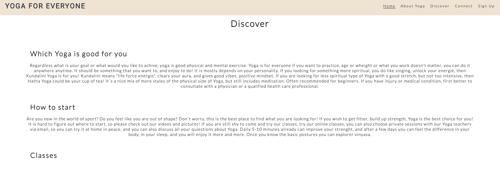
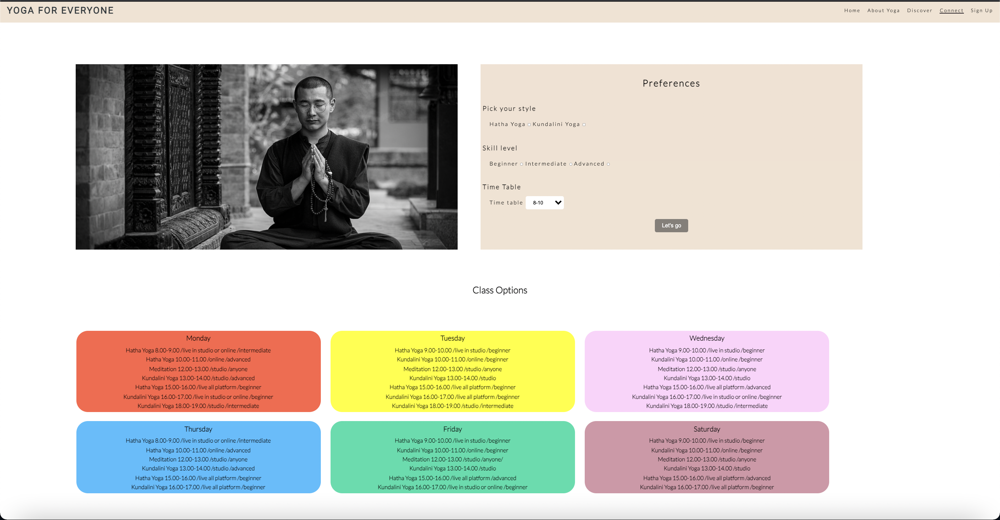
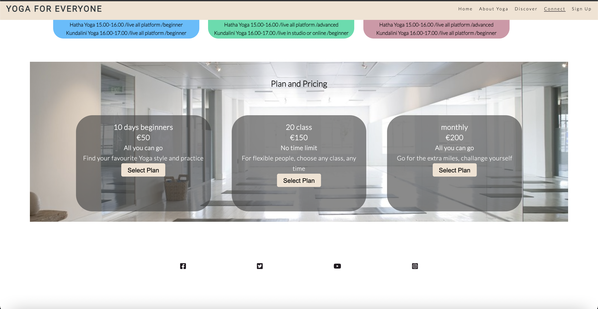
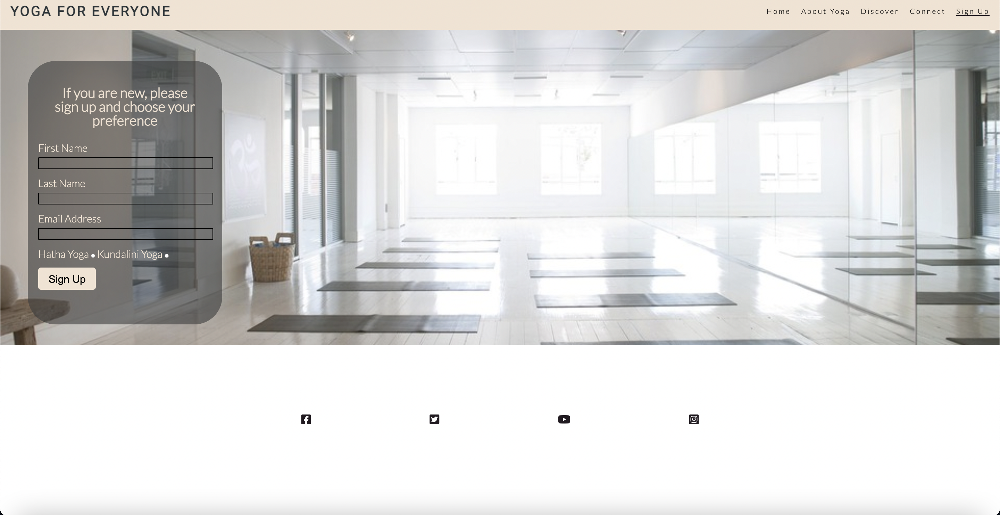

# Contents:

1. Introduction

[view the live project](https://balazs9.github.io/yoga-for-everyone/)

2. UX:

    - User goals
    
    - Creator goals

    - Development plans:

    I. Strategy

    II. Scope

    III. Structure

    IV. Skelton

    V. Surface

3. Features

4. Issues

5. Technologies
    
    - languages used

6. Testing

7. Deployment

8. Credits

# Yoga-for-everyone

Yoga for everyone is a website targeting people with all different skill levels and experience in yoga. Could be anyone who is interested in it, or want to make it part of their life and daily routine. To help everyone to train not just their body, but their mind and soul too. To train in a group where they feel good and calm, to release the stress and charge with positive energie. The site is providing informations about different style of yoga, which can be practiced either online or in our studio sessions. Free your mind, strenghts your body, join us today!

## User Experience

### User goals:

1. First time visitor: 

    - easily understandable site and purpose of the business

    - easy navigation

    - beginners who want to try and learn yoga

    - anyone who already tried Yoga, but would like to improve their skills

    - easy registrations and payment options

2. Returning user:

    - yoga is part of their life and they want to continue

    - they are happy with the group, with the instructor, and find the perfect schedule 

    - correct pricing

    - well managed, well designed website, where easy to book the classes and learn about them

### Creators goal:

1. user friendly website

2. it will work on all devices

3. presentation of images on a wide space to introduce and navigate the client

### Development plans:

I. strategy: 

    The focus of the website:

        Target audience:

        - Beginners in yoga

        - Experienced clients who new to our site

        - Returning clients

        Demographics: 

        - any age who is able to practice yoga

        Psyhographics:

        - yoga lifestyle

        - people who want to join a yoga class

        - train together with others with the same interests

        - want to get a fit body and mind

      Trade-off between importance and viability:

  

II. Scope:

   1. Content requirements:
    
        The client will be looking: 

            - introduction to yoga, guide to the world of yoga

            - explanations of the classes, profiles of the teachers

            - wide selection of training

            - reasanable pricing

    2. Functionality requirements:

            - easy navigation through the pages on the site to find the information what they are looking for

            - choose between plans and pricing what is working with their time schedule

            -find links to external sites to learn more about yoga

III. Structure:

The information of the website was organized in a tree structure, to ensure the clients can navigate easily through the sites.

IV. Skelton:

  1. Figma wireframe

[figma](https://www.figma.com/proto/riVSjbwqPgF0yEbB2yOyYp/Untitled?node-id=2%3A0&scaling=min-zoom)

2. Balsamiq Wireframes for three different screen type

V. Surface:

    Colors: 

    - The main colors used for the website are almond, beige, black and white, with colors of rainbow in one of the section of the website.

    Typography:

    - The Roboto and Lato pairing is used on the website with sans serif.

    Images: 

    - Pixabay [https://pixabay.com/] where the accurate pictures found, all selected carefully with the goal in mind to represent a proffesional yoga website.

## Features

1. Existing features: 
    
    I. on all pages

    - Fixed navbar: allows user to go over the entire website and find what they looking for, with jump on page

    - Footer: contains social social media icons

    II. Home page:

    The main page is divided to three section which contains the following: 
    
    - hero image

    - welcome: introduction to the website and also to yoga

    - discover: how to start practicing yoga and what kind of classes the website is offering

    

    

    

    III. Connect page:

    Contains three section:

    - preferences: the clients can pick what yoga styles they like, what is there skill level and choose from a time frame

    - class options: it is a schedule where the times and classes are visible to the clients with a hover on which is highlithing what the cursor pointing

    - plan and pricing: show the clients three different pricing option 

    

    

    IV. Sign in page:

    

2. Features to implement: 

    - make a Log in page

    - terms and conditions page

    - introduce the bootcamps plan and pricing

    - a select button for the class option section

## Issues

During the development the issues what needed to be fixed:

1. Align 2 divs side by side: the issue was to put the divs next to each other, but searching for the problem on [https://stackoverflow.com/questions/36152145/align-2-divs-side-by-side-in-a-parent] and there found similar problem with a help, what the developer could use as a navigator to fix the issue.

2. Make the divs screen responsive: the issue was the divs did not go well when the screen size was changing, tried many options and than looking for stackoverflow where found a similar problem [https://stackoverflow.com/questions/12645366/css-responsive-center-div] and with the help of this was able to find the error what caused the issue.

## Technologies:

    - HTML5

    - CSS3

    1. Font Awesome:

        -Icons in the footer of each site were taken from font awsome

    2. Google Fonts:

        -google fonts were used to import Lato and Roboto font into style.css

    3. Git:

        -git was used for version control

    4. Github:

        -to store the project code

    5. Wireframe:

        I. Figma wireframe for the dektop screen

        II. Balsamiq Wireframes for three different screen type

    6. Coolors:
        Find colors from a wide selection
        [coolors](https://coolors.co/d496a7-9d695a-78e0dc-8eedf7-a1cdf1)

    7. Am I responsive: to see screen responsive design

## Testing

    1. HTML validator:

        I. index.html: No errors or warning to show.

        II. connect.html: 

            -error messages:

            -no error messages after correcting: removed duplicate id and input lines

[w3c validator](https://validator.w3.org/nu/#textarea)

       
        III. sign-in.html:

            -error messages:

            -no error message after correcting, correct letter, and remove /

    
    2. Jigsaw validator for the CSS file

            - style.css file: no error or warning message

[jigsaw css validator](https://jigsaw.w3.org/css-validator)

            -no error messages after correcting: changed value from auto to numbers

    3. Screen responsive test: 

    Used Am I responsive site for test

[responsiveness](http://ami.responsivedesign.is/#)

## Deploying the project

- The project was developed and astored in Git.

- The source file was regulary pushed to repository [Github](https://github.com/Balazs9/yoga-for-everyone)

- Published from Github repository to Github pages, which is in settings where need to scroll down to Github pages section, here look for source where is a label called none. Change none to master branch and save it.

- Than the page will automatically refresh and the deployed link will be available.

## Credits

1. Pixabay: for the photos what was used for the website

    [https://pixabay.com/]

2. Wikipedia: for the knowledge about Yoga

    Hatha Yoga [https://en.wikipedia.org/wiki/Hatha_yoga]

    Kundalini Yoga [https://en.wikipedia.org/wiki/Kundalini_yoga]